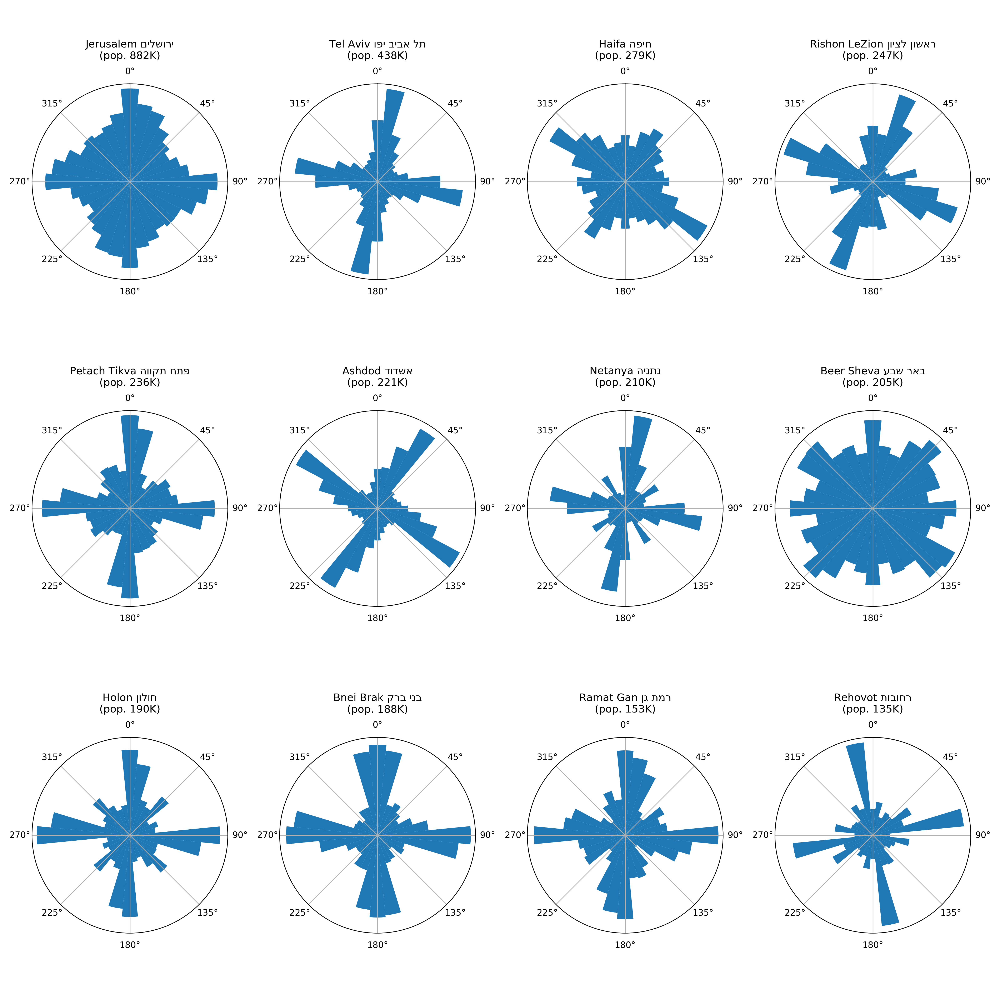

# Israel cities streets orientation

Generate charts which show the distribution on street directions in largest
cities in Israel.

Heavily based on the [excellent work](https://github.com/gboeing/osmnx-examples/blob/master/notebooks/15-calculate-visualize-edge-bearings.ipynb)
of Geoff Boeing, author of the [OSMnx Python library](https://github.com/gboeing/osmnx).

## Chart

## Play with it

You'll need to install Jupyter and the Python packages listed in
`requirements.txt`. Then, download the notebook file
(`israel-cities-street-orientation.ipynb`) and open it in Jupyter.

## Credits

Written by [Dov Murik](https://github.com/dubek).
